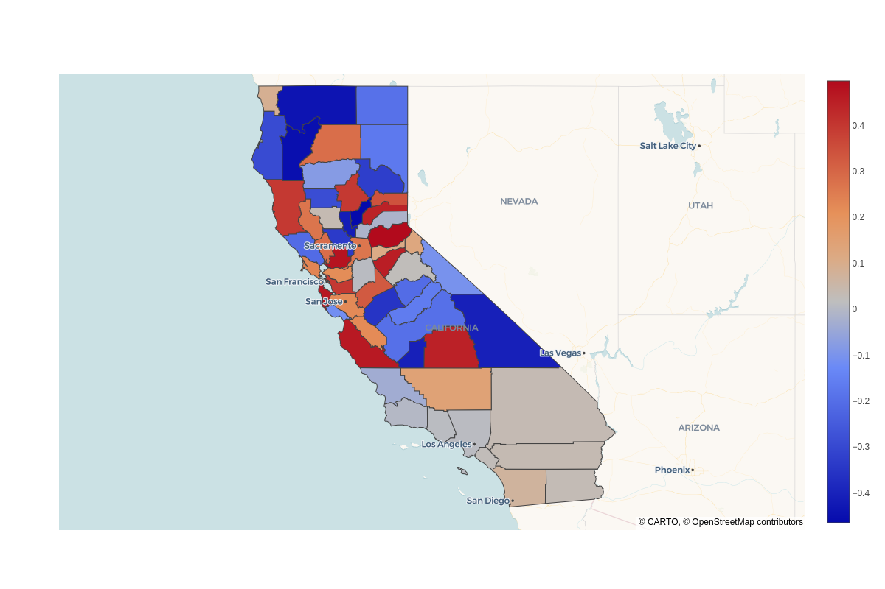
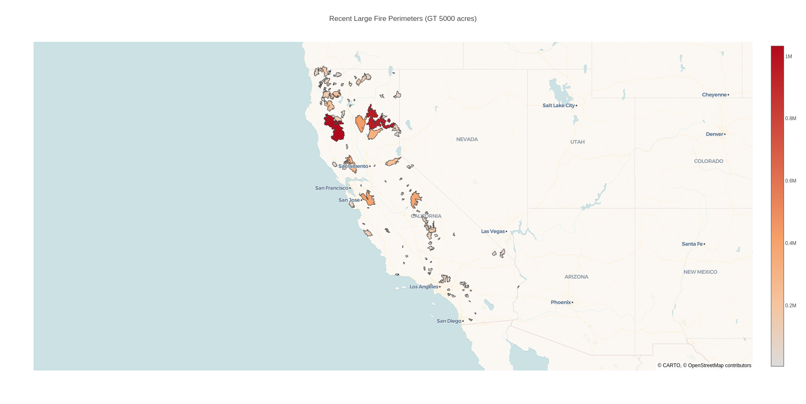

# What is this
This repo looks at plotting GeoJSON data using Plotly.js

# Usage
1. Spin up an http server; `python3 -m http.server 8080`
2. Open the html file; `http://localhost:8080/counties.html`

# Extra steps
## Dataset
To get the counties data, go to data.ca.gov/dataset. They got a lot of GeoJSON datasets you can play around with!
- Here's the specific link: https://data.ca.gov/dataset/california-counties
- And you can check out what it's supposed to look like here: https://gis.data.ca.gov/datasets/CDEGIS::california-counties-3

## Reprojection
Unfortunately, you might get data that's in a coordinate system that's not supported.
- Plotly assumes you use `EPSG:4326`, which are lat/lon.
- The counties data comes in `EPSG:3857`, which are in meters.

So to handle this, you need to *reproject* the GeoJSON.
- I did this by installing `npm install reproject`
- Ran `./node_modules/.bin/reproject --from=EPSG:3857 --to=EPSG:4326 data/California_Counties_6472744560795949404.geojson > data/ca_counties_pc.geojson`
- Now, point Plotly to this geojson `data/ca_counties_pc.geojson` and you're good.

Basically, it's a limitation on Plotly where you have to have your data in `EPSG:4326`. I'm guessing it's because they don't want to be burdened with becoming a full-on GIS suite and stay humble to being a basic plotter, but that's a guess.

# Output
The final output should look like so:

And here's one for the wildfire dataset:
- Open the html file; `http://localhost:8080/fires.html`
- Dataset sourced from https://data.ca.gov/dataset/recent-large-fire-perimeters-gt-5000-acres

